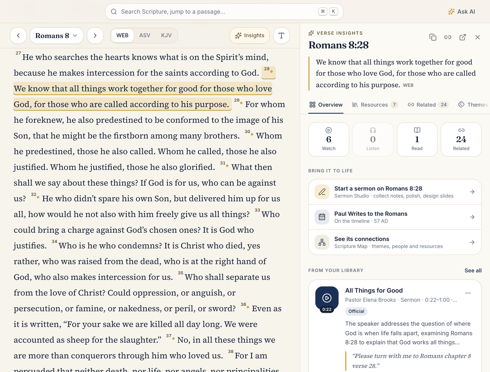
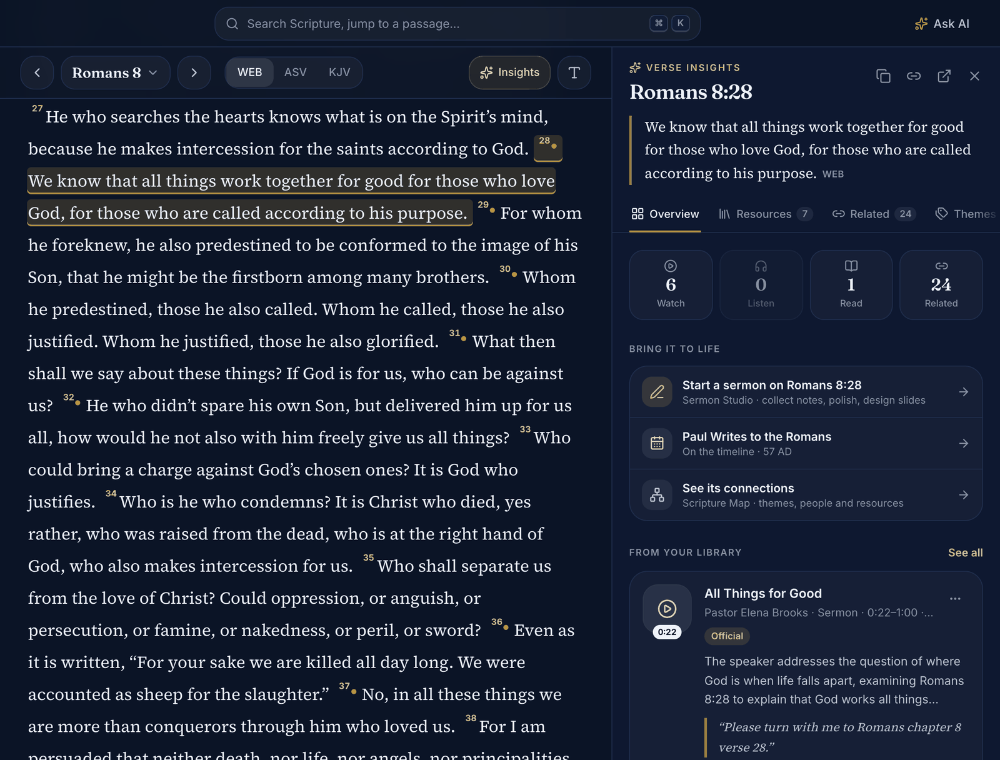
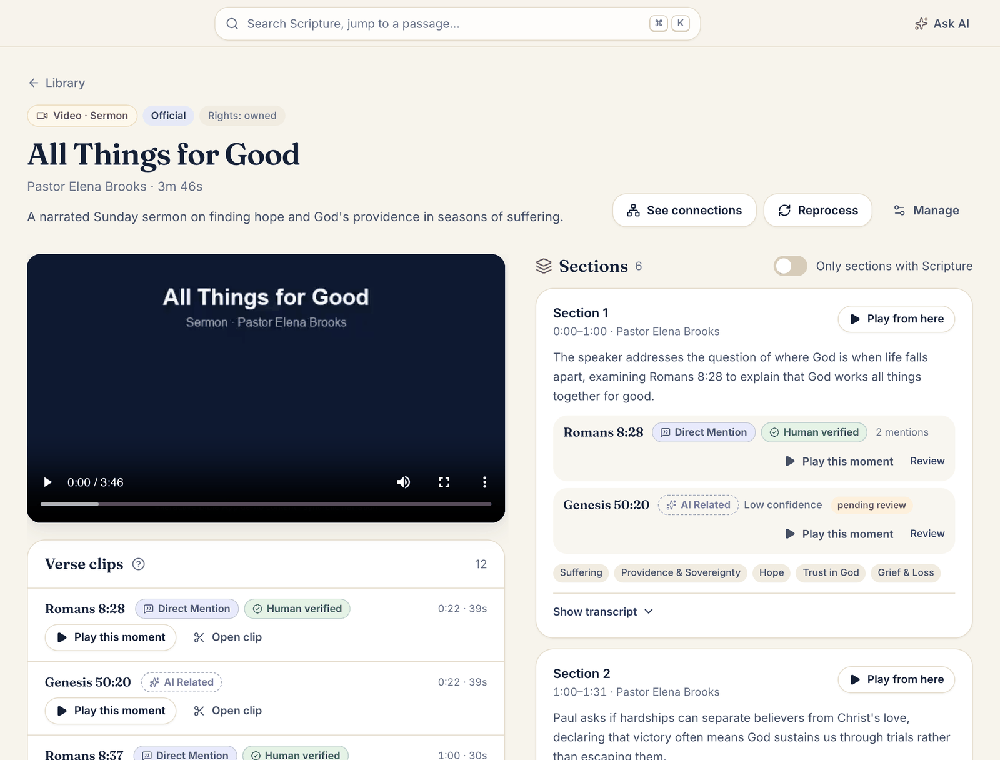
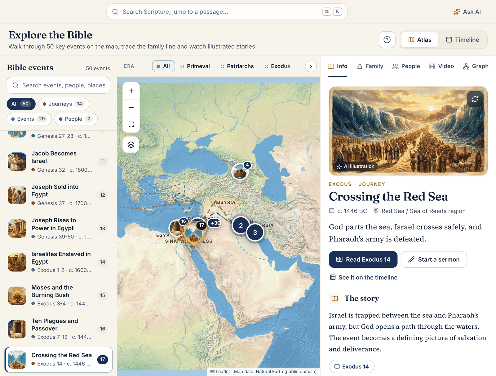
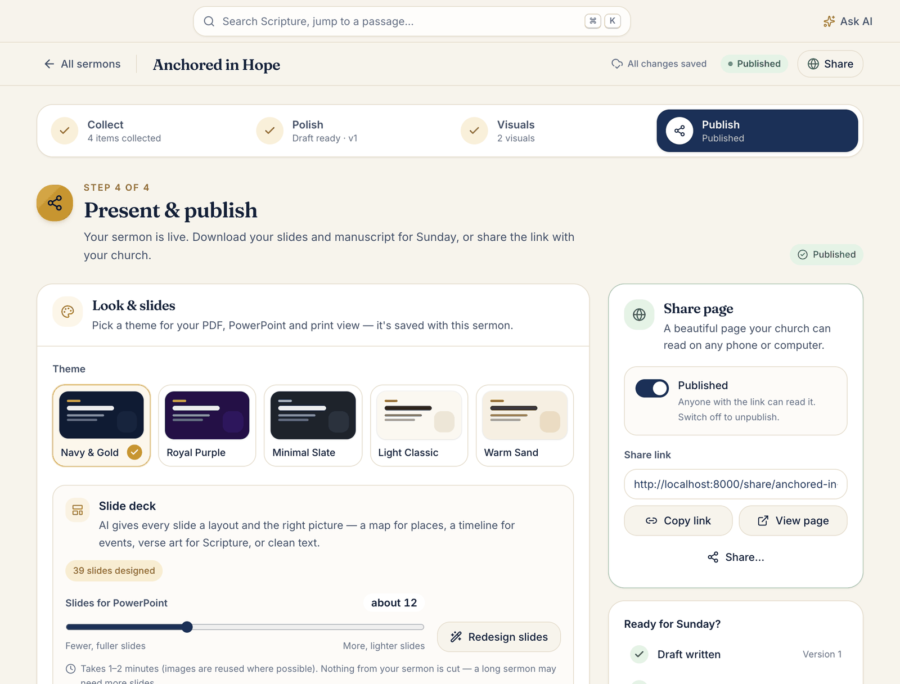
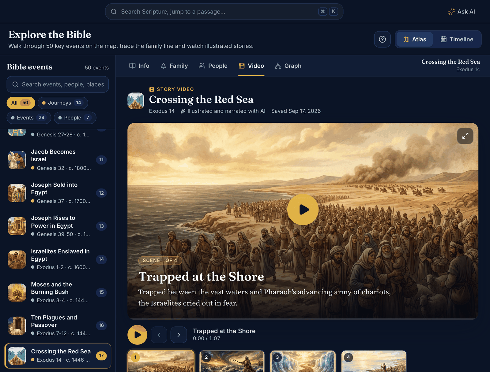
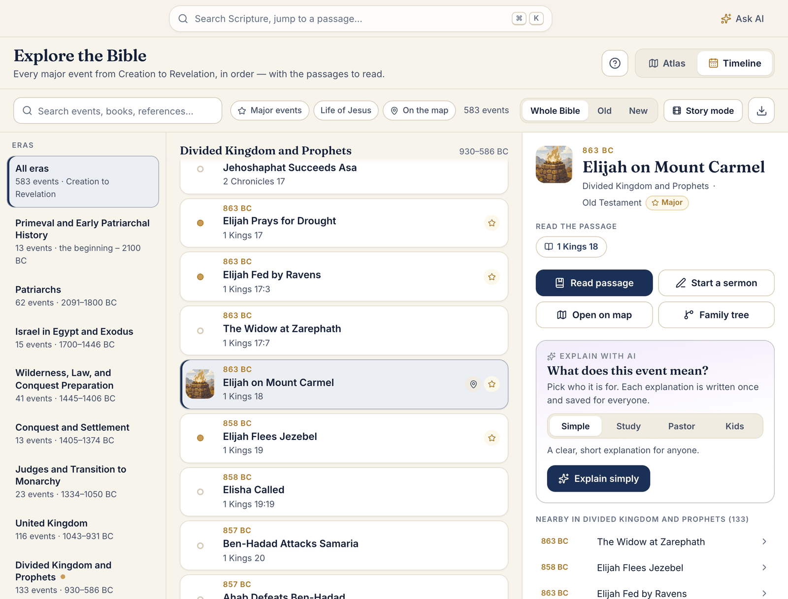
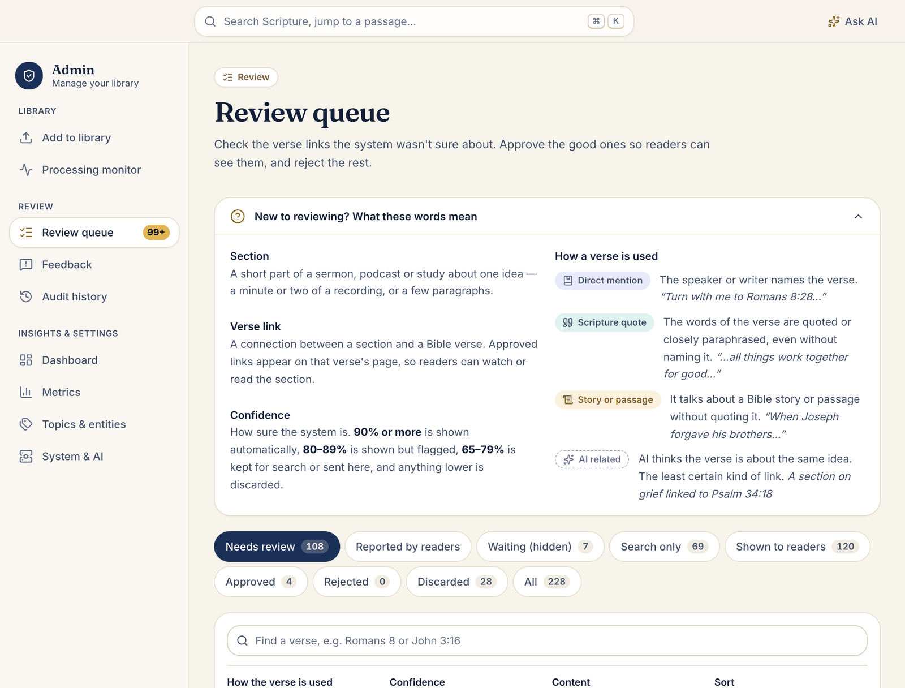
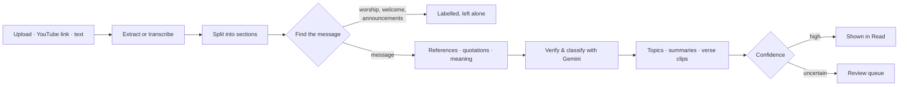

<div align="center">


# Interactive Bible App

**Read the Bible alongside the sermons that explain it, walk through the story on an offline atlas,
and turn your notes into a finished sermon — all on your own computer.**

[](https://github.com/RW2523/interactive-bible-app/actions/workflows/ci.yml)
[](LICENSE)


[Quick start](#quick-start) · [Features](#features) · [User manual](docs/user-manual.md) · [How it works](#how-it-works) · [Docs](#documentation)



</div>

---

## Why

A pastor's study usually lives in five tools: a Bible app, a folder of sermon recordings, a notes app, a slide editor
and a browser full of maps. The Interactive Bible App brings them together around the verse:

- **Every verse knows what your library says about it.** Sermons, podcasts, studies, articles and YouTube talks are split
  into sections and linked to the exact verses they mention, quote or explain — with the evidence, a confidence score,
  and a short clip that starts at the right moment.
- **The story is explorable.** 50 key events on an offline atlas, a 583-event timeline, the family line to Jesus, a
  knowledge graph, and illustrated, narrated story videos.
- **Preparing to preach is guided.** Notes, voice memos, documents and Scripture become a structured, Scripture-grounded
  sermon with visuals, slides, speaker notes, social posts and a share page.
- **It's yours.** The database, files, maps and fonts stay on your machine. Only AI requests go to Google's Gemini API,
  and only when you use an AI feature.

## Features

<table>
<tr>
<td width="50%" valign="top">

### 📖 Read & verse insights
WEB, KJV and ASV with a calm reading view. Tap a verse to see what your library says about it: **Watch**, **Listen**,
**Read**, related verses with *Why related?*, themes, people, a Scripture map, **Ask AI** with citations — and
**Bring it to life** links to start a sermon or open the matching atlas and timeline events.

</td>
<td width="50%" valign="top">



</td>
</tr>
<tr>
<td valign="top">



</td>
<td valign="top">

### 🎬 Library, verse clips & YouTube
Upload video, audio, PDF, DOCX or text — or **paste a YouTube link**. The app reads the captions (the video is never
downloaded), **finds the message inside a full service recording** so worship songs and announcements are labelled and
left out, links each section to verses, and makes a **short clip** for every verse that plays right at that moment.

</td>
</tr>
<tr>
<td valign="top">

### 🗺️ Explore the Bible
An **offline atlas** of 50 events with journeys and regions, a **583-event timeline** from Creation to Revelation,
family line, people, and a knowledge graph. AI adds teaching notes, event illustrations and **narrated story videos**
you can play, render as a captioned video, or export as a full-HD MP4.

</td>
<td valign="top">



</td>
</tr>
<tr>
<td valign="top">



</td>
<td valign="top">

### ✍️ Sermon Studio
Four guided steps — **Collect → Polish → Visuals → Publish**. Type or dictate notes, add recordings and documents, pick
passages (exact verse text is attached), then get a structured sermon in 10 formats, 6 tones and 10 languages. Add
AI visuals, design a slide deck, export **PDF, PowerPoint, print or video**, write speaker notes and social posts, and
publish a share page.

</td>
</tr>
</table>

More: semantic **Search & Ask**, the **Scripture Map** graph, an **admin area** with a review queue for uncertain verse
links, a processing monitor, metrics and system status — in light and dark themes, on desktop and phone.

<details>
<summary><b>More screenshots</b></summary>

| | |
|---|---|
|  |  |
|  |  |

</details>

## Quick start

**Requirements:** macOS or Linux, Python 3.11+, Node.js 18+, PostgreSQL 16/17 with pgvector, and ffmpeg.
On macOS: `brew install postgresql@17 pgvector ffmpeg tesseract poppler node`.

```bash
git clone https://github.com/RW2523/interactive-bible-app.git
cd interactive-bible-app
make setup                 # Python env, web app build, local database, Bible texts, demo content
```

Add your Gemini key (free to create at [Google AI Studio](https://aistudio.google.com/apikey)) to `.env`:

```bash
GEMINI_API_KEY=your-key-here
```

Then start the app:

```bash
make check-gemini          # optional: verifies the key and models
make start                 # runs the app and its background worker
```

Open **<http://localhost:8000>**. There is no sign-in on your own computer — you are the owner with full access
(rename yourself in the profile menu). `make stop` stops the app; `make dev` runs it with hot reload for development.

Phones and other computers on your network can use it too, at `http://<this computer's address>:8000`. They sign in
with an account: setup creates sample accounts whose shared password it saves as `DEMO_PASSWORD` in `.env`
(see [the manual](docs/user-manual.md#on-a-phone-tablet-or-another-computer)).

> **No key yet?** Everything except the AI features still works: reading, the atlas and timeline, the library, reviews,
> exports and anything generated earlier.

## How it works



The backend is **FastAPI** with a **PostgreSQL + pgvector** database and a job queue; the web app is **React 19**.
The pipeline combines a deterministic reference parser, a quotation index across three translations, vector search
and Gemini verification — then routes each link by confidence, so uncertain ones go to a human instead of being shown.
See [docs/architecture.md](docs/architecture.md) for the full design.

## Privacy, AI and costs

| Stays on your computer | Goes to Gemini (only when you use AI) | Read from YouTube |
|---|---|---|
| Database, uploads, sermons, stories, maps, fonts, search index | Text to analyse or write, images to paint, narration to record | A pasted video's details and caption track — never the video |

Library analysis, Ask AI answers and Explore content are cached and reused (Sermon Studio writing and pictures are made
fresh each time). A daily token budget and hourly limits protect you from surprises, AI features on other devices need an
account, and the admin dashboard shows spend. Typical costs measured with the default models:

| Task | Approximate cost |
|---|---|
| 10-minute sermon video with captions | $0.08 |
| 65-minute service with captions (songs skipped) | $0.33 |
| 103-minute service without captions (Gemini transcribes) | $0.61 |
| One AI image (sermon visual, illustration, story scene) | $0.04 |

## Documentation

| Guide | For |
|---|---|
| [User manual](docs/user-manual.md) | Everyone — reading, Explore, Sermon Studio, adding content, reviewing, troubleshooting |
| [Configuration](docs/configuration.md) | Every `.env` setting: personal mode, models, budgets, limits |
| [Architecture](docs/architecture.md) | Pipeline stages, AI prompts, jobs, storage and data model |
| [Development](docs/development.md) | Setup, commands, conventions, tests and evaluation |
| [Contributing](CONTRIBUTING.md) · [Security](SECURITY.md) · [Changelog](CHANGELOG.md) | Contributors |

## Development

```bash
make dev          # API (auto-reload) + worker + Vite dev server → http://localhost:5173
make test         # ~650 backend tests, offline (AI and YouTube are faked)
make typecheck    # TypeScript
make build        # production build of the web app
make eval         # Scripture-mapping evaluation on the gold set
```

Every push and pull request runs the test suite and the web build in [GitHub Actions](.github/workflows/ci.yml).

## Tech stack

**Backend** Python · FastAPI · SQLAlchemy · PostgreSQL 17 + pgvector · yt-dlp · ffmpeg · pypdf · Tesseract ·
**AI** Gemini (text, embeddings, images, speech) · **Frontend** React 19 · TypeScript · Vite · Tailwind CSS 4 ·
TanStack Query · Base UI · Leaflet · Tiptap · jsPDF · PptxGenJS

## Credits and data licenses

- **Bible texts:** World English Bible, King James Version and American Standard Version from [eBible.org](https://ebible.org)
  (public domain), downloaded at setup.
- **Cross references:** [OpenBible.info](https://www.openbible.info/labs/cross-references/) (CC BY).
- **Maps:** [Natural Earth](https://www.naturalearthdata.com) (public domain), bundled for offline use.
- **Fonts:** Inter, Fraunces, Source Serif 4 and JetBrains Mono (SIL Open Font License), bundled via Fontsource.
- Third-party libraries are used under their own licenses.

## Contributing

Issues and pull requests are welcome — please read [CONTRIBUTING.md](CONTRIBUTING.md) first. Report security problems
privately as described in [SECURITY.md](SECURITY.md).

## License

[MIT](LICENSE) © RW2523 and contributors.
