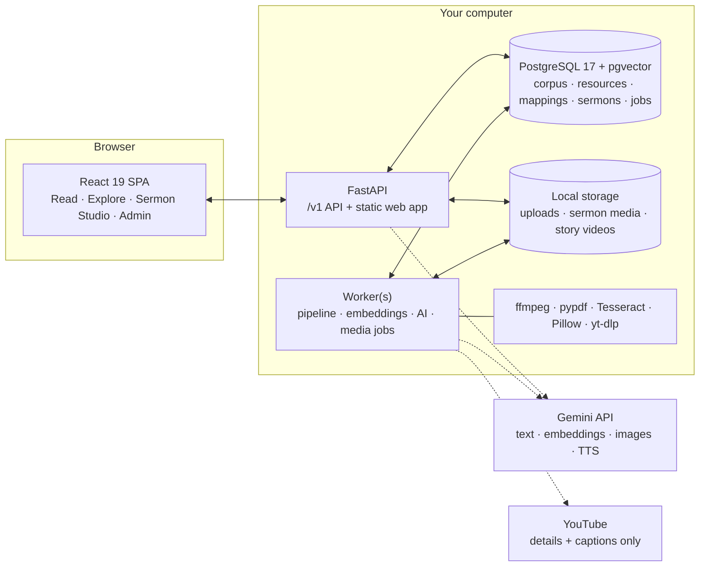

# Architecture

The Interactive Bible App is one local web application: a FastAPI backend with a PostgreSQL job queue and worker, and a
React single-page app that the API serves. Everything runs on the user's computer; the **only remote dependency is the
Gemini API**, called through one client for text, embeddings, images and speech. YouTube is contacted only to read a
pasted video's details and captions.



## Repository layout

```
backend/interactive_bible/
  api/          FastAPI routers: main (read, search, resources, admin, auth, jobs), sermons, explore, files
  pipeline/     orchestrator (ING stages), detectors, merge, enrich (topics, summaries, clips), routing, persist
  ingest/       validation, text extraction (PDF/DOCX/HTML/Markdown), captions, media (ffmpeg), transcription, youtube
  retrieval/    quotation shingle index, full-text and vector search, rank fusion
  bible/        canonical verse ids, 66-book canon, reference parser, corpus loader
  ai/           Gemini REST client, LLM service (schemas, retries, cache, budget, cost log), prompt pack
  services/     verse intelligence, search, ask, review, feedback, clips, scripture map, metrics, sermons/, explore/
  vocab/        topics, people, places, events, life situations; curated topic → key-verse index
  jobs.py, worker.py   PostgreSQL job queue (SKIP LOCKED), progress, heartbeats, graceful hand-back
backend/migrations/    ordered, checksummed SQL migrations applied on start
backend/tests/         pytest suite (offline: a fake Gemini client, a stubbed YouTube extractor)
frontend/src/
  components/   app shell, command palette, verse panel, media player, design-system primitives
  pages/        Home, Read, Search & Ask, Library, resource, clip, Scripture Map, admin
  features/     explore/ (atlas, timeline, stories), sermons/ (dashboard, workspace, exports, share page)
data/explore/          atlas events and the 583-event timeline (data/bible/ is downloaded at setup)
frontend/public/geo/   offline Natural Earth basemap (built by scripts/build_geodata.py)
demo_content/          synthetic demo sermon, podcast, study, devotional and article
eval/                  Scripture-mapping gold set and evaluation harness
```

## Scripture intelligence pipeline

Every library item — upload, pasted text, web article or YouTube link — runs through the same staged pipeline as a
background job. Each stage records its status, timings and details (visible in **Admin → Processing monitor**), and
results are written atomically at the end.

| Stage | What happens |
|---|---|
| ING-01/02 Validate & store | Magic-byte and extension checks, executable and zip-bomb guards, size limits, content hashing |
| ING-03 Extract / transcribe | PDF text (Tesseract OCR for scanned pages) · DOCX · Markdown · HTML article · captions (VTT/SRT) · **YouTube captions** via yt-dlp (human-made preferred, else auto-generated) · **Gemini transcription** (P-00) for recordings without captions, in time windows with timestamp repair |
| ING-04 Normalize | The raw transcript is kept unchanged; a normalised copy carries character offsets |
| ING-05 Segment | Spoken media: 30–120 s sections that never split sentences, refined by P-01; auto-captions without punctuation are grouped by speech pauses; music/speech boundaries always start a new section. Documents: by headings and paragraphs |
| ING-05B **Find the message** | For long recordings, P-16 reads the sections and labels each one — message, worship, welcome, announcements, prayer, reading, communion, testimony, other. Songs are also detected from caption markers (`[Music]`, `♪`). **Only message sections continue**; the rest are stored and labelled |
| ING-06 Explicit references | Deterministic parser (written, spoken and ASR-damaged forms) → P-02 only for uncertain candidates |
| ING-07 Quotations | Shingle index over WEB/KJV/ASV → P-03 classifies exact, close, paraphrase or theme-only |
| ING-08 Candidates | Gemini embeddings + pgvector + full text + themes, fused with reciprocal-rank fusion |
| ING-09 Verify & classify | P-04 (at most 5 strong verses, evidence must be in the section) → merge, dedupe, range collapse → P-05 primary verse |
| ING-10/11 Tags & summaries | P-06 topics, people, places and events against controlled vocabularies · P-07 short summary |
| ING-12 Clips | P-08 picks a clean 15–180 s clip around the evidence (sentence-snapped), with a deterministic fallback |
| AUDIT | P-12 second-pass audit can reject a link or send it to review |
| ING-15/13/14/16 | Confidence routing, storage with human-reviewed links protected across reprocessing, indexing, publish |

**Confidence routing.** ≥ 0.90 is published; 0.80–0.89 is kept for search and review (and shown as *AI related* only
when it is the strongest, well-supported match); 0.65–0.79 is search-only and queued for review; below 0.65 is
discarded. Official content waits for editorial approval. *Confidence is not theological truth* — the UI says so.

### YouTube links

1. `POST /v1/resources/inspect-url` reads the video's details and caption tracks with yt-dlp (never the video file) so
   the *Add to library* form can show a preview and fill itself in.
2. The resource is stored as an `external_embed` video with `rights_status = embed_only`; clip export is disabled.
3. ING-03 downloads only the chosen caption track (JSON3, exact cue times). Machine-translated tracks are ignored.
   A video without captions is transcribed by Gemini from its URL instead.
4. Verse clips play in YouTube's own embedded player, bounded to the clip (`start`/`end`); jumping reloads the embed.

## AI layer

All Gemini access goes through `ai/gemini.py` (REST client with model aliases and fallbacks, JSON-schema output with
schema-mode fallback, retries and backoff, rate limiting, Gemini 3 thinking levels) and `ai/llm.py` (prompt rendering,
Pydantic validation with one retry, a shared result cache, a daily token budget and a call/cost log shown on the admin
dashboard). Prompts live in `ai/prompts/*.md` with a version; the version is stored with every result.

| Family | Prompts |
|---|---|
| **P** — Scripture intelligence | P-00 transcriber · P-01 segmenter · P-02 reference extractor · P-03 quote verifier · P-04 semantic verse mapper · P-05 relationship classifier · P-06 topic/entity tagger · P-07 summary · P-08 clip selector · P-09 "why related" · P-10 search parser · P-11 re-ranker · P-12 quality auditor · P-13 clip caption · P-14 Ask AI · P-15 verse themes · P-16 message locator |
| **S** — Sermon Studio | S-01 polish · S-02 format restructure · S-03 coaching suggestions · S-04 speaker notes · S-05 slide enrichment · S-06 visual prompt · S-07 outreach posts |
| **E** — Explore | E-01 event teaching content · E-02 story script · E-03 timeline explanation · E-04 timeline story mode |

Grounding rules: Scripture wording is only quoted from supplied verse texts (the app attaches exact local text), user
content is fenced as untrusted data, and every number the UI shows comes from code, not from a model.

## Jobs, storage and files

- **Job queue.** PostgreSQL table with `SKIP LOCKED` workers, dedupe keys, retries with backoff, per-job progress
  (`step`, `done`, `total`, `message`), worker heartbeats, and graceful hand-back on stop. Queues: `pipeline`, `ai`,
  `embeddings`, `media` (story MP4s, clip exports).
- **Storage.** Files live under `storage/`; the database keeps keys. Files are served through HMAC-signed
  `/v1/files/...` URLs (sermon media and Explore stories) or token-checked media routes with HTTP range support.
- **Caching.** Explore content, timeline explanations and stories are generated once and served to everyone from the
  cache; HTTP responses use version-based ETags.

## Data model highlights

| Area | Main tables |
|---|---|
| Bible | `bible_verses` (canonical, translation-independent ids like `ROM.8.28`), `bible_verse_texts`, `verse_relationships` (OpenBible cross references), `verse_embeddings` |
| Library | `resources`, `resource_transcripts` (immutable), `resource_segments` (content-addressed ids, clips, `part`, `non_speech_ratio`), `verse_resource_links` (relationship, confidence, evidence, review status, provenance) |
| Review | `review_actions`, `feedback`, `audit` via review actions |
| AI | `llm_calls` (cost log), `llm_cache`, `processing_runs` (stage history) |
| Sermon Studio | `sermons`, `sermon_inputs`, `sermon_drafts`, `sermon_media`, `sermon_outreach` |
| Explore | `explore_stories`, `explore_event_cards` |
| Platform | `users`, `organizations`, `jobs`, `worker_heartbeats`, `schema_migrations` |

## Design decisions

- **PostgreSQL job queue instead of a broker** — one less service to run; workers scale by process.
- **Content-addressed segment ids** keep human-reviewed links attached when a resource is reprocessed.
- **Virtual clips by default** — clips are start/end times on the original media; physical export only when rights allow.
- **Precision first for AI links** — measured on the gold set, weaker semantic matches were mostly thematic neighbours,
  so they stay searchable and reviewable rather than shown.
- **Message-only mapping for services** — worship lyrics and announcements are labelled, never mined for verse links.
- **Offline basemap** — Natural Earth relief reprojected to Web Mercator and bundled; no tile server.
- **Personal mode** — no sign-in on the computer running the app; other devices still sign in.
